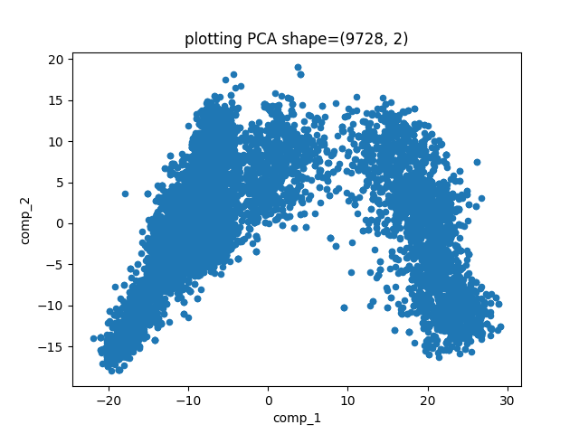
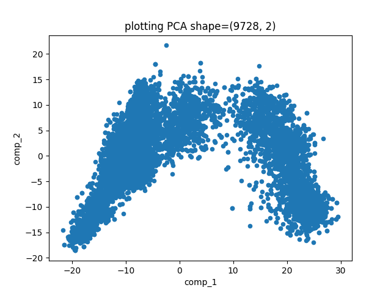

# Plan of Action

remember this project is meant to explore triplet loss function and training image transformers

## things to implement 

- triplet data generator

- inception like cnn using keras

- triplet loss function 

- embedding similarity comparison function (just distance function for testing)

## style and other things?

- _no inheritance allowed!_ <= lets not be silly here, oo has its place just like functional

- keep in functional for the confusing bits (not strict)

## notes on trained networks

### Encoders

- encoder - first version of network, using maxpooling and 3 inception modules, outputing 4k vector

- encoderII - similar to above, outputing a smaller 256-D vector 

- encoderIII - similar to above but using average pooling, outputing 256-D vector
-- this network seem to have better performance compared to above 
-- due to less 'information loss' at average pooling layers

- encoder IV(smaller network)<= seems like slightly worse performance, V(smaller network + sigmoid activation) <= hard to train, worse performance

- encoder VI - three inception modules, average pooling, ELU activation instead of relu - 256-D vector, best one yet?

- encoder Basic - two layer convolution groups with average pool, seem to preform similarly to above 

## Is this a blog?

### problem one: final accuracy (same/different classification) is stuck at 18% (20% when lady luck visits)
#### hypothesis I :
   the verification network (fully connected binary classifier looking for same label class) is shit
   
   - First Round 
    response : increased and decreased complexity of the network and tried various activation functions.
    result : small increase to 20% acc, no material changes, my guess is that the verification network isn't the problem
    
   - Back Again
    why? : encoder output visually inspected and cross checked with other encoders. it seems to have decent seperation in the groups
    The fully connect network may be the problem after all.
    what to do? : use more classic algorithmic methods to classify  
    
#### hypothesis II 
   the encoder network is shit
    
   how can I test this? 
   visually inspect the encodings see if these is anything interesting.
    sooo..... I looked, there are many negative values with some HUGE positive clumps <=cool story bro
            
   project the 256-D vectors onto a 2-D space using PCA then visually inspect the data.
    here is what I got 
    My human eyes can spot 6 to 8 groups of dots. Not sure if this is a good result or not. 
    Given that the plotted is only a 2-d projection of the embeddings, 
    the 256-D embeddings should have more than enough space for seperating the 10 classes
    Maybe a more robust encoder is needed.  
      
   Here is another plot of encodings generated by encoderBasic, looks largely similar to the plot above.
     Given that this network has 1/6 the trainable params than the inception based ones, it's awesome that this one can perform just as well.
     I feel a little silly for using inception modules right off the bat now (although it may still be useful for more complex data like tree rings)
     I'm incline to say that the embedding is ok for now and some effort need to be put into the fully connected layers  
     
      
      